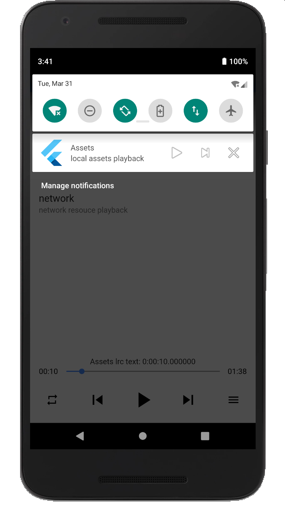

# audio_manager

A flutter plugin for music playback, including notification handling.
> This plugin for android is based on mediaplayer, iOS is based on AVPlayer development



## iOS
Add the following permissions in the `info.plist` file
```
	<key>UIBackgroundModes</key>
	<array>
		<string>audio</string>
	</array>
	<key>NSAppTransportSecurity</key>
	<dict>
		<key>NSAllowsArbitraryLoads</key>
		<true/>
	</dict>
```

## Android
Since `Android9.0 (API 28)`, the application disables HTTP plaintext requests by default. To allow requests, add `android:usesCleartextTraffic="true"` in `AndroidManifest.xml`

```
<application
	...
	android:usesCleartextTraffic="true"
	...
>
```

## How to use?
The `audio_manager` plugin is developed in singleton mode. You only need to get`AudioManager.instance` in the method to quickly start using it.

## Quick start
⚠️ you can use local `assets` resources or `network` resources

```
// Initial playback. Preloaded playback information
AudioManager.instance
	.start(
		"assets/audio.mp3",
		// "network mp3 resource"
		"title",
		desc: "desc",
		cover: "assets/ic_launcher.png",
		// cover: "network cover image resource")
	.then((err) {
	print(err);
});

// Play or pause; that is, pause if currently playing, otherwise play
AudioManager.instance.playOrPause()

// events callback
AudioManager.instance.onEvents((events, args) {
	print("$events, $args");
}
```
